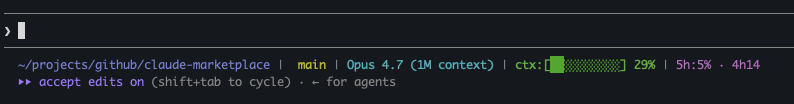

# Claude Marketplace

Skills, hooks, agents, and slash commands for [Claude Code](https://claude.ai/claude-code), organized into independent, themed plugins — install only the stacks you work with.

## Quick start

```text
/plugin marketplace add FabienSalles/claude-marketplace
/plugin install common@fabien-claude-marketplace
```

Then use it — e.g. ask Claude to *"plan this feature with spec-first-dev"* or *"grill me on this design"*. Browse the [catalog](#plugins), install the packs for your stack, and you're set. Other install methods (`setup.sh`, `npx skills`, `skillkit`) are [below](#installation).

## Design philosophy

What this marketplace optimizes for — and, just as deliberately, what it refuses to do:

- **Human stays the controller.** Git, commits, and PRs are opt-in, never automated behind your back.
- **Smallest change that works.** Skills push back on unrequested surface — anti-over-engineering is the default, not a mode.
- **Discipline as skills, not runtime.** Plain `SKILL.md` conventions. No heavy MCP servers, personas, or scaffolding to stand up.
- **Curated, not accumulated.** Every pack is weighed against the alternatives — the [`self-audit`](plugins/self-audit/README.md) plugin literally runs that comparison — instead of piling on.

## Plugins

Grouped by theme. Each links to the plugin's own README with the full skill catalog and links to every `SKILL.md`.

### Craft & quality

| Plugin | What it does |
|---|---|
| [**craft**](plugins/craft/README.md) | Cross-language craftsmanship principles (refactoring, OOP, code style, testing, TDD, DDD) that the language packs build on. |

### Workflow & planning

| Plugin | What it does |
|---|---|
| [**goal**](plugins/goal/README.md) | Source→plan→autonomous `/goal` issue→PR workflow. GitHub, commit, and PR all opt-in — never forced. |
| [**common**](plugins/common/README.md) | Shared workflow tools — planning, research, context-window, TDD/feature-dev commands, code-review/test hooks, a UI agent. |
| [**superpowers**](plugins/superpowers/README.md) | Cherry-picked [obra/superpowers](https://github.com/obra/superpowers) — `verification-before-completion`, `systematic-debugging`. |
| [**pocock**](plugins/pocock/README.md) | Cherry-picked [mattpocock/skills](https://github.com/mattpocock/skills) — `grill-me`, `grill-with-docs`, `zoom-out`. |

These overlap — [**docs/workflows-decision-guide.md**](docs/workflows-decision-guide.md) maps which planning / execution workflow to reach for, and when.

### Languages & stacks

| Plugin | What it does |
|---|---|
| [**php**](plugins/php/README.md) | PHP 8.2/8.3 conventions — code style, OOP, DDD, refactoring, SQL, Composer. Framework-agnostic. |
| [**phpunit**](plugins/phpunit/README.md) | PHPUnit TDD workflow + test conventions (DAMP/AAA/Prophecy). Layers on `craft`. |
| [**symfony**](plugins/symfony/README.md) | Personal Symfony overlay — FormType, Twig components, PRG. Distinct from `atournayre/symfony`. |
| [**typescript**](plugins/typescript/README.md) | Typing, code style, functional, OOP, DDD events, refactoring. |
| [**nest**](plugins/nest/README.md) | NestJS architectural conventions + DDD. |
| [**vitest**](plugins/vitest/README.md) | Vitest TDD workflow + test conventions. |
| [**astro**](plugins/astro/README.md) | Astro 5.x — routing, content collections, i18n, SEO, Tailwind, React islands, view transitions. |
| [**frontend**](plugins/frontend/README.md) | Clean/hexagonal architecture, Container/Presentation, safe edits to existing UI. |
| [**jquery**](plugins/jquery/README.md) | jQuery module structure, `js-*` selector hooks, per-block scoping, symmetric toggles. |
| [**tooling**](plugins/tooling/README.md) | Docker, Drizzle ORM, pnpm workspaces, Zod, Claude plugin + npx skills conventions. |

### Security

| Plugin | What it does |
|---|---|
| [**audit**](plugins/audit/README.md) | Overlay on `netresearch/security-audit` (`security-overrides`) + stack code patterns (`ts-security`). |
| [**security-audit**](https://github.com/netresearch/security-audit-skill) *(external)* | netresearch OWASP/CWE/CVSS baseline — 80+ checkpoints, 61 references. |
| [**security-runtime**](plugins/security-runtime/README.md) | Runtime hooks — CLAUDE.md injection scanner (SessionStart) + Bash prompt-injection blocker (PreToolUse). |

### Meta-tooling

| Plugin | What it does |
|---|---|
| [**self-audit**](plugins/self-audit/README.md) | `/self-audit:compare` — audits an external skill pack vs this marketplace into a prioritized gap backlog. |

### Platform & UX

| Plugin | What it does |
|---|---|
| [**mac**](plugins/mac/README.md) | macOS/BSD shell discipline (bash 3.2 vs 5+, BSD vs GNU) + a `bsd-gnu-lint` PreToolUse hook. |
| [**statusline**](plugins/statusline/README.md) | Colored bar — cwd, branch, model, context %, 5h rate-limit usage + reset countdown. |

### Marketing

| Plugin | What it does |
|---|---|
| [**marketing-content**](plugins/marketing-content/README.md) | LinkedIn, SEO blog, direct-response copy, editing, calendar, repurposing, SEO briefs, schema markup. |
| [**marketing-strategy**](plugins/marketing-strategy/README.md) | ICP, mental models, 139 growth ideas, competitor analysis, positioning/GTM (April Dunford). |
| [**marketing-distribution**](plugins/marketing-distribution/README.md) | Multi-platform social, Twitter/X + Reddit threads, email subject lines, newsletter growth. |
| [**marketing-analytics**](plugins/marketing-analytics/README.md) | GA4/GTM/UTM tracking setup, Google Analytics Data API + Search Console reporting. |

## Installation

**Recommended — Claude Code plugins (`/plugin`):**

```text
/plugin marketplace add FabienSalles/claude-marketplace
/plugin install common@fabien-claude-marketplace
/plugin install php@fabien-claude-marketplace
# …one install line per pack you want
```

The `statusline` plugin needs one extra activation step — see [Statusline](#statusline) below.

<details>
<summary><strong>Other install methods</strong> — <code>setup.sh</code> (dev mode), <code>npx skills</code>, <code>claude plugin</code>, <code>skillkit</code></summary>

### Via `setup.sh` (local marketplace registration)

For active development of the marketplace. The script registers this clone as a local marketplace in `~/.claude/settings.json` (`extraKnownMarketplaces.fabien-claude-marketplace`) and toggles packs via `enabledPlugins.<pack>@fabien-claude-marketplace`. No symlinks — edits in `plugins/*/` are picked up live on the next Claude Code session.

```bash
git clone https://github.com/FabienSalles/claude-marketplace.git
cd claude-marketplace

./setup.sh                  # interactive
./setup.sh --all            # install everything
./setup.sh --pack php ts    # selected packs (ts → typescript)
./setup.sh --status         # show installed packs
./setup.sh --remove php     # uninstall a pack
```

### Via `npx skills add`

Works with the [`npx skills`](https://github.com/anthropics/skills) ecosystem. Same `SKILL.md` format, no Claude Code required.

```bash
npx skills add FabienSalles/claude-marketplace --list   # list available skills
npx skills add FabienSalles/claude-marketplace          # install everything
```

### Via `claude plugin install`

Install a single plugin through the official Claude Code CLI (without going through `/plugin marketplace add`).

```bash
claude plugin install FabienSalles/claude-marketplace/plugins/php   # install one plugin
claude plugin validate plugins/php                                  # validate a manifest
```

### Via `skillkit`

Natively compatible — same `SKILL.md` format.

```bash
skillkit install FabienSalles/claude-marketplace
```

</details>

## Statusline



Claude Code does not accept the `statusLine` key in `plugin.json`, so a small slash command finishes the wiring after `/plugin install statusline`:

```text
/plugin install statusline@fabien-claude-marketplace
/statusline:setup
```

Full details — colored screenshot, segment-by-segment breakdown, refresh-interval tip — live in [`plugins/statusline/README.md`](plugins/statusline/README.md).

## Contributing

Adding or editing a plugin, manifest conventions, local validation (`scripts/health-check.sh`), and what CI enforces are all in [`CONTRIBUTING.md`](CONTRIBUTING.md).

## License

MIT
