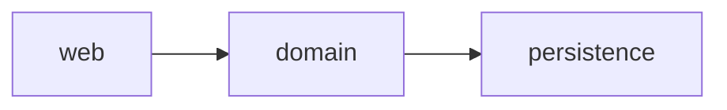
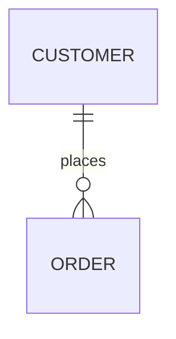

# Artifact templates

Skeletons for every file the skill produces. Keep the headings; drop sections that
are genuinely empty rather than filling them with "N/A" prose.

## README.md (the shared-brain index)

```markdown
# <Project> — legacy knowledge base

Built <date> with legacy-discovery, mode: <onboarding|audit-prep>.

## Routing table

| To answer questions about… | Read |
|---|---|
| Stack, size, activity, who knows this code | [recon.md](recon.md) |
| Modules, layers, dependency direction, violations | [architecture.md](architecture.md) |
| What the system does for whom | [use-cases/](use-cases/) (index below) |
| Domain vocabulary and naming conflicts | [glossary.md](glossary.md) |
| Tables, entities, relationships, schema drift | [entity-model.md](entity-model.md) |
| Where it will break, where to start safely | [risk-register.md](risk-register.md) |
| Input vectors, authz matrix, secrets (audit-prep mode only) | [security-surface.md](security-surface.md) |
| What we still don't know | [open-questions.md](open-questions.md) |

## Use cases

| ID | Name | Actor | Status |
|---|---|---|---|
| UC-001 | … | … | complete / needs-human-validation |

## Artifact status

| Artifact | Status | Last updated |
|---|---|---|
| recon.md | complete | <date> |

## Update discipline

New fact learned → update the ONE artifact that owns it, resolve the matching
open question if any, add a line here if a plan is invalidated. Never fork new
documents; route, then edit in place.
```

## recon.md

```markdown
# Recon

## Identity
Stack, framework + version (EOL status), runtime version (EOL status), infra hints.

## Numbers
| Metric | Value |
|---|---|
| Source files / LOC | |
| Entry points (HTTP / CLI / async / cron) | |
| Tables / entities | |
| Test files vs source files | |
| First commit → last commit | |
| Active committers (12 mo / all-time) | |

## Churn hotspots (top 10, noise excluded)
| File | Changes (2y) | LOC | Has tests? |
|---|---|---|---|

## Recent focus (3 months)
What the team is currently working on, from commit paths.

## How to run it
Build, test, and local-run commands as discovered (or "unknown — see open questions").
```

## architecture.md

````markdown
# Architecture

## Modules / bounded contexts
One short paragraph each: purpose, key namespaces, entry points it owns.

## Dependency direction


## Declared vs actual
Where the code violates its own claimed structure (domain importing
infrastructure, controllers with SQL, …). Each violation: file evidence.

## Cross-cutting mechanisms
Auth, events/listeners, feature flags, caching, i18n — where each lives.
````

## use-cases/UC-XXX-kebab-name.md

```markdown
# UC-XXX — <Name in the user's language>

- **Primary actor**:
- **Goal**:
- **Entry points covered**: (routes/commands this use case aggregates)
- **Status**: Implemented | Partial | Unclear

## Preconditions

## Main success scenario
1. Actor …
2. System …

## Alternative flows
- **A1 — <trigger>** (diverges from step N): …

## Business rules
- **BR-XXX**: … (IDs unique across ALL use-case files)

## Doubts
What the code left ambiguous (mirror these in open-questions.md).
```

## glossary.md

```markdown
# Glossary

| Term | Meaning (as the code suggests) | Seen in | Conflicts |
|---|---|---|---|
| | | class/table/route names | e.g. "'client' and 'customer' both map to the CUSTOMER table" |
```

## entity-model.md

````markdown
# Entity model

Source of authority: migrations (up to <last migration>), cross-checked against
ORM mapping. Drift found: <none | list>.

## Relationships


### CUSTOMER
One sentence of business meaning.

| Attribute | Business meaning | Constraints / policy |
|---|---|---|
| status | Lifecycle state | enum: active, suspended, closed — transitions enforced in <file> |

Only attributes carrying business rules need a row; skip plumbing columns.
````

## risk-register.md

```markdown
# Risk register

## Top risks
| # | Risk | Evidence | Impact | Cheapest mitigation |
|---|---|---|---|---|
| 1 | Untested churn hotspot | file + churn count + no test file | | characterization test |

## Dependency health
EOL runtime/framework, unmaintained critical packages, pinned ancient versions.

## Schema/code drift
Divergence between migrations and ORM mapping found while building the entity
model — each with the file evidence.

## Dead-code suspicions
Entry points nothing references, feature-flagged code whose flag never flips.

## Safe first changes
Well-tested, low-coupling areas where work can start without fear.
```

## open-questions.md

```markdown
# Open questions

Ordered by how much of the model depends on the answer. This is the agenda for
the first team meetings.

| # | Question | Blocks | Asked to | Answer |
|---|---|---|---|---|
| 1 | Is the `legacy_export` cron still used by anyone? | dead-code cleanup, UC-007 | | |
```
